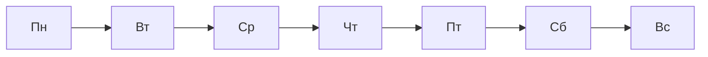

# Неделя Untitled

*Ссылки «прошлая / следующая неделя» появятся, когда имя файла в формате `YYYY-Www`.*



## Дневники недели

```dataview
TABLE WITHOUT ID
  file.link as "День",
  file.cday as "Дата"
FROM "DAILY/Daily"
WHERE contains(string(week), this.file.name)
SORT file.name ASC
```

## :LiTarget: Цели недели


## :LiFiles: Заметки за неделю

*Permanent и literature за интервал ISO-недели (даты подставляются при создании заметки из шаблона).*

*Не удалось вычислить границы недели по имени файла — проверь формат `YYYY-Www` или открой заметку заново из Periodic Notes.*

## :LiMessagesSquare: Рефлексия

**Что получилось:**

- 

**Что не получилось:**

- 

**Что вынести дальше:**

- 
